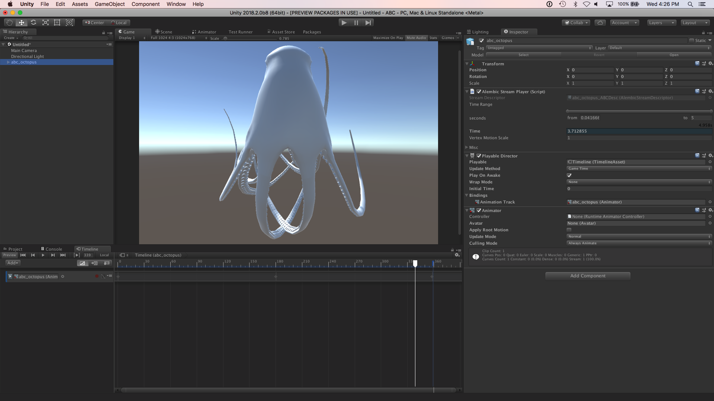
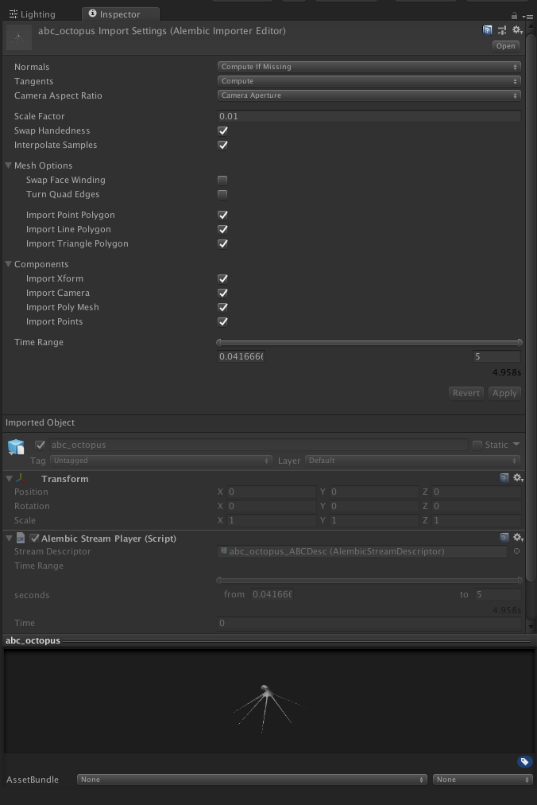
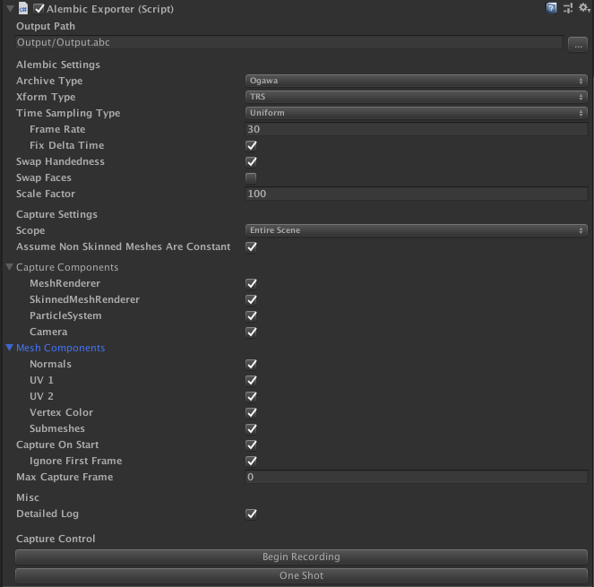

# About the Alembic package

Use the Alembic package to import [Alembic](http://www.alembic.io/) files into your Unity scenes. This lets you bring in vertex cache data, for example facial animation (skinning) and cloth simulation (dynamics), from other software packages and have it playback exactly the same way in Unity.

The Alembic package supports the import and playback of Meshes, Points and Cameras.

## Requirements

Version 0.2.0-preview is compatible with Unity Editor 2018.2

The package is available on 64-bit desktop platforms:
* Windows 10
* macOS Sierra (10.12)
* GNU/Linux (Centos 7, Ubuntu 16.x and Ubuntu 17.x)

## Known Limitations

* There is no exposed public API in the Alembic package.

We welcome hearing about your experience on [this forum thread](https://forum.unity.com/threads/alembic-for-unity.521649/).

# Quick start to using Alembic

Drag an ABC file into the project view to import the ABC asset.

Then drag the ABC asset into the scene and scrub the Time property on the component.

To animate using Timeline Editor, can create a Timeline. You can  animate the time property directly as shown below. 

Alternatively, you can drag and drop the scene object with the ABC asset onto an empty area on Timeline area and create an Alembic Track with an Alembic Clip. If you are starting from an empty Timeline you will need to create the Alembic track first.

# Importing Alembic Files

When you put ABC files in the Assets folder under your Unity Project, Unity automatically imports and stores them as Unity Assets. To view the import settings in the Inspector, click on the file in the Project window. You can customize how Unity imports the selected file by setting the properties on this window:

| Property:| Function: |
|:---|:---| 
|__Normals__   "Read From File" "Compute If Missing"  "Always Compute"   "Ignore" |Defines if the normals from .abc file are used or calculate based on vertex position. The default "Compute If Missing" will use abc file normals, otherwise they will be calculated. |
|__Tangents__   "Compute"   "None"| Defines if the tangents are computed and is enabled by default. Since the ABC file has no tangent data, there are only 2 choices. However, please note that the calculation of tangents requires normals and UV data, and if these are missing the tangent cannot be computed.  Please note that the calculation of tangentsis expensive, so if not require then disabling of this option will increase the speed of playback.|
|__Camera Aspect Ratio__   "Camera Aperture" "Default Resolution" "Current Resolution"| Defines whether to set the Unity Camera's aspect ratio. By default the ABC file will set the camera aspect ratio. The Alembic Importer uses the default resolution from the Player Settings. The Current Resolution refers to the aspect ratio define by the Screen. |
|__Scale Factor__ | |
|__Swap Handedness__ | |
|__Interpolate Samples__ | |
|__Swap Face Winding__ | |
|__Turn Quad Edges__ | |
|__Import Point Polygon__ | |
|__Import Line Polygon__ | |
|__Import Triangle Polygon__ | |
|__Import Xform__ | |
|__Import Camera__ | |
|__Import Poly Mesh__ | |
|__Import Points__ | |
|__Time Range__ | |

# Exporting Alembic Files

The Alembic exporter supports exporting single frame and multi-frame Alembic files and can export game objects with the following components:
* MeshRenderer
* SkinnedMeshRenderer
* ParticleSystem
* Camera

To configure a scene to export ABC file, add the AlembicExporter component to the appropriate game objects. The component can be configure to export the entire scene or individual objects.

Using the AlembicExporter component automatically disable Draw Call Batching. If the Mesh group is valid after being batched then it the  will be exported, in some cases the data will be batched multiplied times and the results may change.  If you want to control the Batch settings they can be found in the Rendering section of Player Settings.

The Alembic exporter can be customized by setting the properties on this component:

| Property:| Function: |
|:---|:---| 
|__Output Path__ | |
|__Archive Type__ | |
|__Xform Type__ | |
|__Time Sampling Frame Rate__ | |
|__Time Sampling Frame Rate__ | |
|__Swap Handedness__ | |
|__Swap Faces__ | |
|__Swap Factor__ | |
|__Capture Scope__ | |
|__Assume None Skinned Meshes Are Constant__ | |
|__Capture MeshRenderer__ | |
|__Capture SkinnedMeshRenderer__ | |
|__Capture Particle__ | |
|__Capture Camera__ | |
|__Mesh Components Normals__ | |
|__Mesh Components UV1__ | |
|__Mesh Components UV2__ | |
|__Mesh Components Vertex Color__ | |
|__Mesh Components Submeshes__ | |
|__Capture On Start__ | |
|__Ignore First Frame__ | |
|__Max Capture Frame__ | |
|__Detailed Log__ | |
|__Begin Recording__ | |
|__One Shot__|Captures the current.|

# Using Timeline: Working with Alembic

The Timeline can be used to playing back Alembic animation as well as control 
the Alembic Stream Player.

## Recording Alembic Stream Player's Current Time with an Infinite clip

## Playing back an ABC file using an Alembic Shot clip

# Working with Materials and Alembic

The Alembic package does not support remapping Face Set names to Materials or creating Materials from Face Set names. By default the Alembic with import Meshes using the Default Material.

You need to manually assign your Materials for each object imported.
